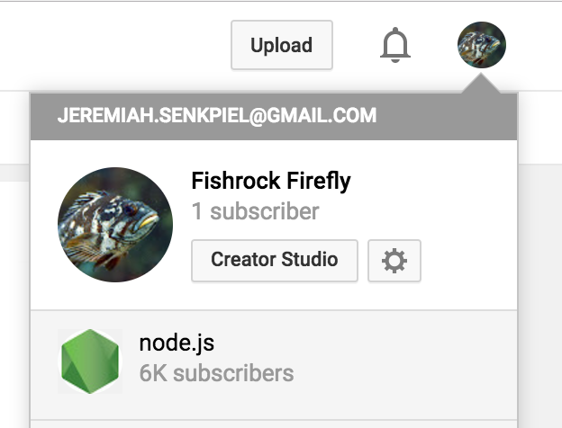
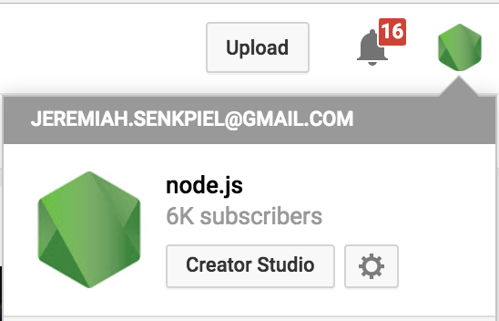
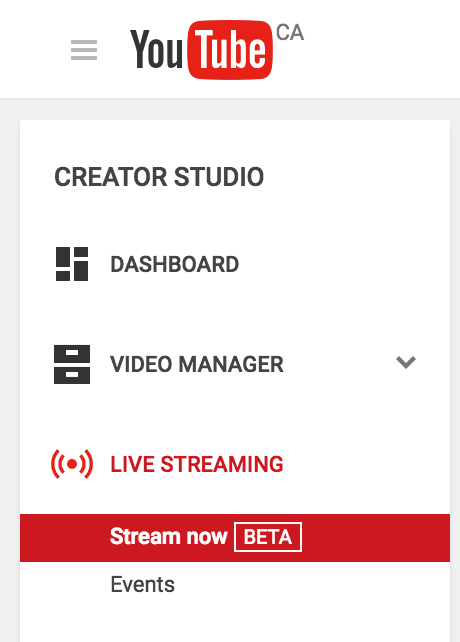
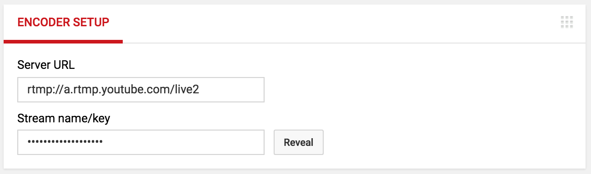

# Streaming Meetings to Youtube

This is a guide on how to set up a live broadcast video encoder for the
purpose of streaming Node.js meetings live to Youtube.

Ask @Mikeal to add you as a manager for the Node.js Youtube if you need to stream in this way.

## Encoder Setup

### Switch account to Node.js



### Open Youtube's Creator Studio



### Navigate to the Live Streaming tab



### Fetch Stream Key



## Preparing for a meeting

### Edit the stream Title and Description

The title should be set to the same format as the meeting issue title, but with the date moved to the front.

The description should be a link to the meeting issue.


### Share the meeting once you've gone live.

The meeting link should be `http://www.youtube.com/c/nodejs-foundation/live`.

Send it in a tweet such as:
```
.@nodejs Core Technical Committee meeting live now: http://www.youtube.com/c/nodejs-foundation/live
```

Adjust the `Core Technical Committee` part as necessary and remove the `.@nodejs` if tweeting from the official twitter account.


## Check stream status

This should say online when you are streaming, and usually be green.

However, it may turn yellow and issue a warning in a "stream health" section below. Since we usually stream with static images for the video, there will often be warnings that the video bitrate is low. This is a not a problem and should almost always be ignored.


## Check how many people are watching


## Moderate the chat and solicit questions

Moderation follows the [Moderation Policy](../Moderation-Policy.md). Messages can be moderated right-clicking and selecting the necessary action, such as `remove`.

During TSC meetings, there is a section of public Q&A at the end.
It is important to solicit for questions **well in advance** of public Q&A sections so that people have time to think of and type questions.
